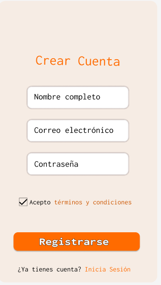
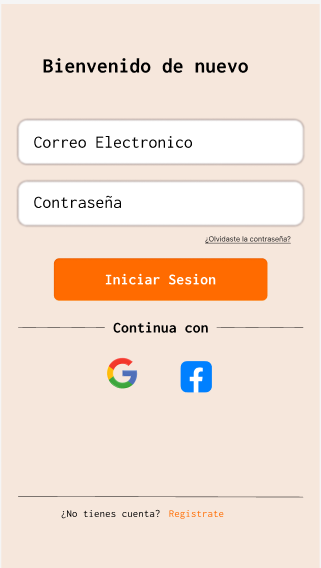
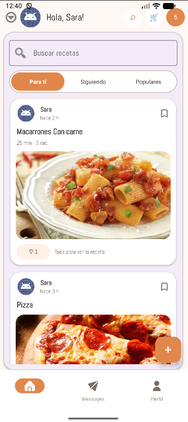
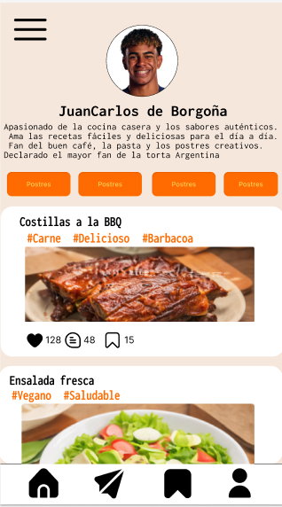
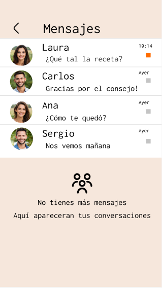
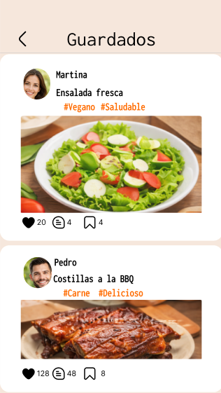

# Sazón

Sazón es una aplicación Android para personas aficionadas a la cocina que quieren publicar recetas, descubrir platos de otros usuarios, guardar ideas, seguir perfiles y conversar dentro de una comunidad gastronómica.

El proyecto forma parte del **Proyecto Integrador** del ciclo de **Desarrollo de Aplicaciones Multiplataforma (DAM)** y se desarrolla de forma incremental, con Firebase como base de autenticación, datos en tiempo real y almacenamiento.

---

## Diseño en Figma

El diseño de la aplicación se ha realizado en Figma y sirve como referencia visual para la implementación en Android.

https://www.figma.com/design/yHjedo6Y4G4Co4WEa7LY2A/Sin-t%C3%ADtulo?node-id=0-1&p=f&t=fkQQFC4GstUwoPPk-0

---

## Autores

**Alejandro Barroso**  
Developer y organizador del repositorio

**Fernando Cecilia**  
Developer y organizador del proyecto

Ambos autores participan en el diseño, la planificación y el desarrollo técnico de la aplicación.

---

## Cuentas de prueba

Para revisar la app sin registrarse hay cuentas de demostración en Firebase Authentication. Son cuentas de prueba con datos ficticios:

| Correo | Contraseña |
|---|---|
| `fer1@test.com` | `123456` |
| `fer2@test.com` | `123456` |
| `test1@sazon.com` | `123456` |

Pareja recomendada para probar el chat en dos dispositivos: `fer1@test.com` y `fer2@test.com`.

---

## Estado actual

El proyecto ya tiene implementado el flujo principal de una red social de recetas:

- **Autenticación** con Firebase Auth mediante email y contraseña.
- **Recuperación de contraseña** por correo.
- **Registro** con creación de usuario y perfil base en Firestore.
- **Feed de recetas** alimentado desde Firestore, con buscador y pull-to-refresh.
- **Creación de recetas** desde la app, con subida opcional de foto a Firebase Storage.
- **Detalle de receta** con acciones de like, guardar, comentar, compartir, eliminar y acceso al perfil del autor.
- **Comentarios en recetas** en tiempo real mediante subcolecciones de Firestore.
- **Likes y guardados persistentes** en Firestore, con estado por usuario en feed y detalle.
- **Perfil propio** con foto de perfil en Firebase Storage, nombre, biografía, contadores y pestañas de recetas propias y guardadas.
- **Perfil ajeno** con carga de datos reales y botón de seguir o dejar de seguir.
- **Sistema de seguimiento** con contadores de seguidores y siguiendo.
- **Chats en tiempo real** con Firestore, lista de conversaciones y búsqueda de usuarios por correo.
- **Mensajes** con burbujas diferenciadas, separadores de fecha, hora y lectura básica.
- **Modo demo** para mostrar contenido cuando todavía no hay datos reales.

---

## Funcionalidades pendientes

Los siguientes puntos siguen abiertos para completar la experiencia final:

- Edición completa de recetas ya publicadas.
- Listas navegables de seguidores y siguiendo.
- Recorte de imagen de avatar.
- Indicador de escribiendo y presencia en línea en el chat.
- Notificaciones push.
- Pantalla de ajustes completa.
- Login con Google.
- Revisión de reglas de Firebase para un entorno de producción.

---

## Pantallas diseñadas

El diseño cubre las principales pantallas de navegación de la app.

### Pantalla de inicio


### Registro



### Inicio de sesión



### Feed principal



### Perfil



### Mensajes



### Recetas guardadas



---

## Arquitectura

La aplicación usa una arquitectura ligera basada en **Activities**, **Controllers**, **Adapters**, modelos y repositorios auxiliares.

```text
app/src/main/java/com/sazon/proyectointegrador/
 ├── SplashActivity
 ├── LoginActivity
 ├── RegisterActivity
 ├── MainActivity
 ├── ChatActivity
 ├── ProfileActivity
 ├── CreateRecipeActivity
 ├── RecipeDetailActivity
 ├── ui/
 │    ├── feed/FeedController
 │    ├── chats/ChatsController
 │    └── profile/ProfileController
 ├── adapters/
 │    ├── ChatThreadAdapter
 │    ├── ChatMessageAdapter
 │    ├── PublicacionAdapter
 │    └── PublicacionGridAdapter
 ├── model/
 │    ├── Publicacion
 │    ├── ChatThread
 │    ├── ChatMessage
 │    ├── ChatItem
 │    └── ChatDateHeader
 └── util/
      ├── SessionManager
      ├── RecipeRepository
      ├── FollowRepository
      ├── AvatarHelper
      ├── DemoData
      └── SimpleTextWatcher
```

---

## Modelo de datos

### Firestore

```text
users/{uid}
  uid, name, email, bio, avatarUrl, createdAt
  followers, following, recipes

users/{uid}/followers/{followerUid}
users/{uid}/following/{followingUid}
users/{uid}/saved/{recipeId}

recipes/{recipeId}
  authorId, autor, titulo, descripcion, imageUrl, likes, createdAt

recipes/{recipeId}/likes/{uid}
recipes/{recipeId}/comments/{commentId}
  recipeId, authorId, authorName, text, createdAt

chats/{chatId}
  participants
  participantsNames
  lastMessage, lastSenderId, lastMessageAt

chats/{chatId}/messages/{msgId}
  text, senderId, createdAt, readAt
```

### Storage

```text
avatars/{uid}.jpg
recipes/{uid}/{timestamp}.jpg
```

---

## Tecnologías

- Java
- Android SDK
- Firebase Auth
- Cloud Firestore
- Firebase Storage
- Firebase Analytics
- Material Design 3
- AndroidX
- Glide
- Gradle Kotlin DSL
- Git y GitHub
- Figma

---

## Instalación

```bash
git clone https://github.com/abarrosomagan/ProyectoIntegrador.git
```

1. Abrir el proyecto en Android Studio.
2. Sincronizar Gradle.
3. Usar un emulador con Google Play Services o un dispositivo Android físico.
4. Configurar Firebase para el proyecto correspondiente.
5. Habilitar Authentication con email y contraseña.
6. Habilitar Firestore Database.
7. Habilitar Cloud Storage.
8. Ejecutar la app desde Android Studio.

---

## Reglas mínimas de Firestore para desarrollo

```js
rules_version = '2';
service cloud.firestore {
  match /databases/{database}/documents {
    match /users/{uid} {
      allow read: if request.auth != null;
      allow write: if request.auth != null && request.auth.uid == uid;

      match /{sub=**} {
        allow read, write: if request.auth != null;
      }
    }

    match /recipes/{recipeId} {
      allow read: if request.auth != null;
      allow create: if request.auth != null
        && request.auth.uid == request.resource.data.authorId;
      allow update, delete: if request.auth != null
        && request.auth.uid == resource.data.authorId;

      match /likes/{uid} {
        allow read: if request.auth != null;
        allow write: if request.auth != null && request.auth.uid == uid;
      }

      match /comments/{commentId} {
        allow read: if request.auth != null;
        allow create: if request.auth != null
          && request.auth.uid == request.resource.data.authorId;
      }
    }

    match /chats/{chatId} {
      allow read, update: if request.auth != null
        && request.auth.uid in resource.data.participants;
      allow create: if request.auth != null
        && request.auth.uid in request.resource.data.participants;

      match /messages/{msgId} {
        allow read: if request.auth != null
          && request.auth.uid in get(/databases/$(database)/documents/chats/$(chatId)).data.participants;
        allow create: if request.auth != null
          && request.auth.uid == request.resource.data.senderId;
      }
    }
  }
}
```

---

## Reglas mínimas de Storage para desarrollo

```js
rules_version = '2';
service firebase.storage {
  match /b/{bucket}/o {
    match /avatars/{uid}.jpg {
      allow read: if request.auth != null;
      allow write: if request.auth != null && request.auth.uid == uid;
    }

    match /recipes/{uid}/{fileName} {
      allow read: if request.auth != null;
      allow write: if request.auth != null && request.auth.uid == uid;
    }
  }
}
```

---

## Roadmap

1. Añadir edición completa de recetas.
2. Completar perfiles sociales con listas de seguidores y siguiendo.
3. Pulir chat con presencia, escritura y notificaciones.
4. Revisar reglas de Firebase para producción.
5. Preparar una demo estable para presentación.

---

## Licencia

Proyecto desarrollado con fines académicos.

El contenido puede utilizarse como referencia educativa citando a los autores.
